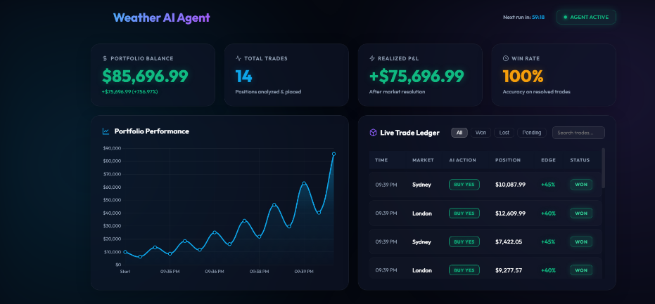
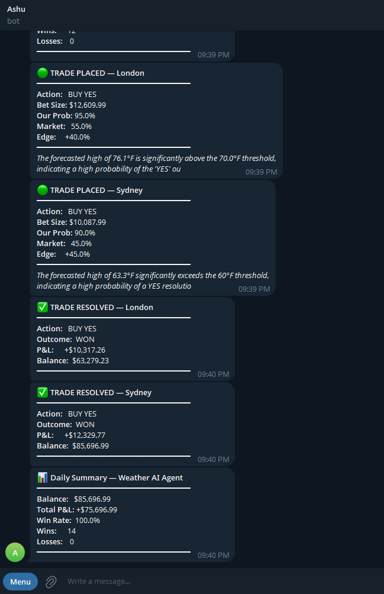

<div align="center">
  
  <br/>
  <h1>🌩️ Weather AI Trading Agent</h1>
  <p>An autonomous AI agent that monitors global weather, discovers Polymarket weather bets, and executes data-driven trades using LLM reasoning and Kelly Criterion risk management.</p>
</div>

---

## 📸 Dashboard & Live Execution

The project features a sleek, real-time web dashboard to monitor the AI's autonomous trading cycles and portfolio performance.

<div align="center">
  
  <br>
  <em>Live portfolio tracking and trade resolution ledger.</em>
</div>

### 📱 Telegram Bot Integration

The agent also sends live trade execution logs, edge analysis, LLM reasoning, and daily portfolio summaries directly to Telegram.

<div align="center">
  
</div>

---

## 🚀 Quick Start

### 1. Install Dependencies
```bash
pip install -r requirements.txt
```

### 2. Configure API Keys
Copy the example environment file:
```bash
copy .env.example .env
```
Open `.env` and fill in your keys:
- `OPENROUTER_API_KEY`: Get from [OpenRouter](https://openrouter.ai) (Free Llama-3 usage)
- `APIFY_API_TOKEN`: Get from [Apify](https://apify.com) (For weather scraping)
- `TELEGRAM_BOT_TOKEN`: Get from BotFather on Telegram (Optional)
- `TELEGRAM_CHAT_ID`: Your chat ID for alerts (Optional)

### 3. Run the Agent & Dashboard
The best way to run the agent is to launch the live web dashboard. The background worker will autonomously execute trades on the defined interval.

```bash
python main.py --dashboard
```
*Then open `http://localhost:8000` in your browser!*

#### Other Commands:
```bash
# Run a single agent cycle in the terminal
python main.py

# Run the agent on a continuous loop in the terminal
python main.py --loop

# Run the agent using the Hermes Agent framework bindings
python main.py --hermes-run
```

---

## 🏗️ Project Architecture

| Component | File | Purpose |
|-----------|------|---------|
| **Core App** | `main.py` | Entry point for running the dashboard or CLI agent |
| **Dashboard UI** | `web/dashboard.py` | FastAPI backend and static web server |
| **Hermes Agent** | `src/agent.py` | Natively integrates with `hermes-agent` bindings and OpenRouter |
| **Risk Engine** | `src/trader.py` | Calculates edge, places Kelly bets, and hedges adverse positions |
| **Data Fetcher** | `src/weather.py` | Pulls live metrics from Open-Meteo & Apify |
| **Markets** | `src/markets.py` | Resolves available weather markets (Simulated Polymarket) |
| **Database** | `src/database.py` | Logs trades and portfolio history to SQLite |
| **Alerts** | `src/telegram_alert.py` | Broadcasts trades & reasoning to Telegram |

---

## 🌍 Monitored Markets

The AI continuously monitors and evaluates weather conditions across 5 major global markets:

| City | Country | Airport Code |
|------|---------|---------|
| **New York** | 🇺🇸 USA | KLGA |
| **London** | 🇬🇧 UK | EGLL |
| **Tokyo** | 🇯🇵 Japan | RJTT |
| **Sydney** | 🇦🇺 Australia | YSSY |
| **Dubai** | 🇦🇪 UAE | OMDB |

---

## 📈 Risk Management Strategy

The AI utilizes the **Kelly Criterion** (specifically, Half-Kelly for reduced volatility) to mathematically optimize bet sizing based on its calculated edge over the market.

```python
edge = our_probability - market_price
bet_size = (edge / (1 - market_price)) * 0.5 * bankroll
```
*The agent will automatically `SKIP` trades if the calculated edge does not meet the strict 10% minimum threshold.*

### 🛡️ Defensive Hedging
If the agent detects a severe adverse edge swing (e.g. `edge < -20%`) against an already `PENDING` trade, it will automatically panic-hedge by purchasing the opposite side (e.g. `BUY NO`) to lock in capital and minimize total portfolio downside.

---
<div align="center">
  <em>Built for the CrowdWisdomTrading AI assessment.</em>
</div>
