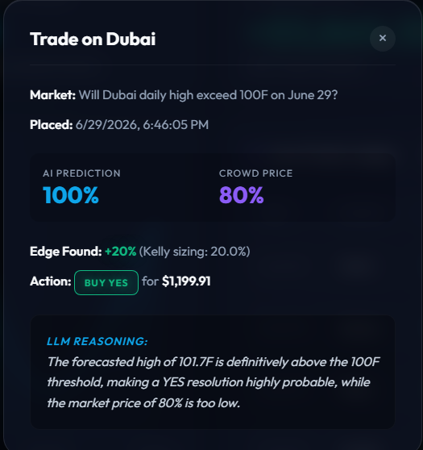

<div align="center">
  
  <br/>
  <h1>🌩️ Weather AI Trading Agent</h1>
  <p><em>An autonomous AI agent that leverages real-time weather data and Large Language Models to find profitable arbitrage opportunities in prediction markets.</em></p>
</div>

---

## 🎯 The Project Need

Prediction markets (like Polymarket) allow users to bet on real-world events, including whether a specific city will hit a certain temperature. However, **weather conditions change rapidly**, and prediction market odds often lag behind real-time meteorological forecasts. 

Humans cannot monitor global weather APIs and market odds 24/7. **The Weather AI Trading Agent solves this problem** by acting as an autonomous, tireless analyst. It continuously monitors live forecasts, compares them to current market odds, uses an LLM to reason through the data, and mathematically sizes bets when it finds a profitable edge.

---

## 🛠️ Tools & Technologies Used

This project is built using a modern, lightweight Python stack designed for speed and autonomous execution:

- **Language**: Python 3
- **Web Framework**: [FastAPI](https://fastapi.tiangolo.com/) (Powers the real-time monitoring dashboard)
- **AI / LLM**: [OpenRouter](https://openrouter.ai/) (Routes requests to LLMs like Llama-3 for decision making)
- **Data Sources**: 
  - [Open-Meteo](https://open-meteo.com/): Primary free API for live meteorological data.
  - [Apify](https://apify.com/): Secondary scraping engine for enriched weather data.
- **Market Data**: Polymarket Gamma & CLOB APIs (Simulated execution)
- **Database**: SQLite (Local, zero-config ledger for trades and portfolio history)
- **Notifications**: Telegram Bot API (For pushing live trade alerts to your phone)

---

## 🧠 How It Works

The agent runs on a continuous loop, executing the following pipeline every hour:

1. **Fetch Live Weather**: Pulls the day's high/low temperatures, rain probability, and wind speeds for 5 major global cities (New York, London, Tokyo, Sydney, Dubai).
2. **Scan Markets**: Connects to Polymarket to find open betting markets related to those specific cities and extracts the current crowd odds (e.g., "72% chance of YES").
3. **AI Reasoning**: Feeds the weather data and market odds into an LLM. The AI compares the true forecast against the market's threshold and decides if the market is priced incorrectly.
4. **Risk Management**: If the AI decides to trade, the **Kelly Criterion** math engine calculates exactly how much of the portfolio to risk based on the perceived "edge".
5. **Execution & Ledger**: The trade is placed, recorded in the local SQLite database, and the portfolio balance is updated.

<div align="center">
  <br>
  
  <br>
  <em>The AI Trade Ledger: Showing the AI's calculated edge, confidence, and LLM reasoning step-by-step.</em>
</div>

---

## 📈 Portfolio & Performance Tracking

The agent isn't just a background script; it comes with a beautiful, real-time web dashboard. From the dashboard, you can monitor the AI's autonomous trading cycles and track portfolio growth.

<div align="center">
  
  <br>
  <em>Live portfolio tracking showing balance growth and individual trade resolutions.</em>
</div>

---

## 📱 Live Telegram Alerts

Never miss a trade. The agent is integrated directly with Telegram. Whenever the AI finds an edge and places a bet—or when a market resolves as WON or LOST—you receive an instant push notification with the full breakdown of the trade.

<div align="center">
  
</div>

---

## 🚀 Quick Start Guide

Want to run the autonomous agent yourself? Follow these steps:

### 1. Install Dependencies
Ensure you have Python installed, then install the required packages:
```bash
pip install -r requirements.txt
```

### 2. Configure API Keys
Copy the example environment file to create your own configuration:
```bash
copy .env.example .env
```
Open `.env` in a text editor and fill in your keys:
- `OPENROUTER_API_KEY`: Get a free key from [OpenRouter](https://openrouter.ai).
- `APIFY_API_TOKEN`: Get from [Apify](https://apify.com) (Optional, for advanced weather data).
- `TELEGRAM_BOT_TOKEN`: Get from BotFather on Telegram (Optional, for phone alerts).
- `TELEGRAM_CHAT_ID`: Your personal chat ID (Optional).

### 3. Run the Agent Dashboard
Launch the FastAPI web server. The background worker will automatically start executing its trading cycles.

```bash
python main.py --dashboard
```
*Once running, open `http://localhost:8000` in your web browser!*

#### Advanced CLI Commands:
If you prefer running the agent without the UI:
```bash
# Run a single autonomous cycle and exit
python main.py

# Run continuously in the terminal
python main.py --loop
```

---

## 🏗️ Project Architecture

| Component | File | Purpose |
|-----------|------|---------|
| **Core App** | `main.py` | Entry point for running the dashboard or CLI agent |
| **Dashboard UI** | `web/dashboard.py` | FastAPI backend and static web server |
| **Hermes Agent** | `src/agent.py` | Natively integrates with `hermes-agent` bindings and OpenRouter |
| **Risk Engine** | `src/trader.py` | Calculates edge, places Kelly bets, and hedges adverse positions |
| **Data Fetcher** | `src/weather.py` | Pulls live metrics from Open-Meteo & Apify |
| **Markets** | `src/markets.py` | Resolves available weather markets (Simulated Polymarket) |
| **Alerts** | `src/telegram_alert.py` | Broadcasts trades & reasoning to Telegram |

---

## 🌍 Monitored Markets

The AI continuously monitors and evaluates weather conditions across 5 major global markets:

| City | Country | Airport Code |
|------|---------|---------|
| **New York** | 🇺🇸 USA | KLGA |
| **London** | 🇬🇧 UK | EGLL |
| **Tokyo** | 🇯🇵 Japan | RJTT |
| **Sydney** | 🇦🇺 Australia | YSSY |
| **Dubai** | 🇦🇪 UAE | OMDB |

---

## 📈 Risk Management Strategy

The AI utilizes the **Kelly Criterion** (specifically, Half-Kelly for reduced volatility) to mathematically optimize bet sizing based on its calculated edge over the market.

```python
edge = our_probability - market_price
bet_size = (edge / (1 - market_price)) * 0.5 * bankroll
```
*The agent will automatically `SKIP` trades if the calculated edge does not meet the strict 1% minimum threshold.*

### 🛡️ Defensive Hedging
If the agent detects a severe adverse edge swing (e.g. `edge < -20%`) against an already `PENDING` trade, it will automatically panic-hedge by purchasing the opposite side (e.g. `BUY NO`) to lock in capital and minimize total portfolio downside.
